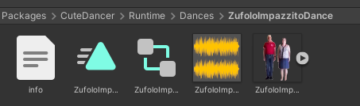
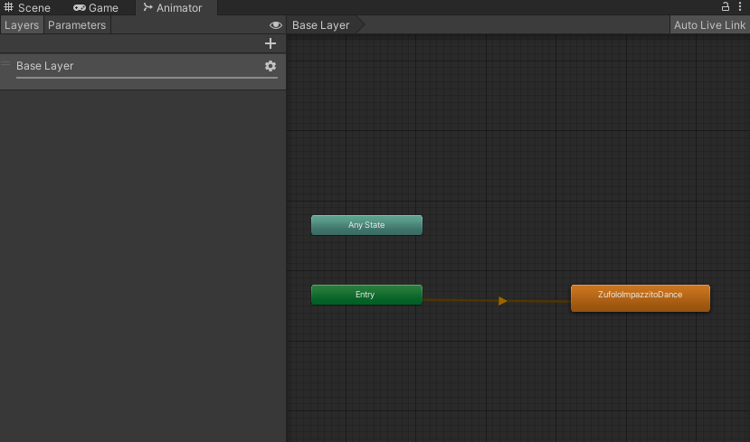

#### Basic Emote layout (v4)


### Step 1:
##### Create Emote info file 
##### "info" with no file Extention and no Quotemarks

##### Contents should be as follows

```json
{
    "name": "ExampleDance",
    "displayName": "Example Emote",
    "collection": "Community Addons",
    "author": "bob",
    "order": 1
}
```
##### notes on "order": 
`order is the index that the emote will show in the setup menu starting from index 1 try not to overlap order numbers`

### Step 2:
##### Create An Empty Animation Contoller with the name from Step 1 "name"
##### drop in the animation file you want to add into the folder and the controller
##### The Controller should look like this


##### Notes:
##### Refer to the basic Emote layout image
`Place the Animation, Audio, Controller and Icon with the same name as the one in "name" from Step 1 'E.G. "ExampleDance"'`


